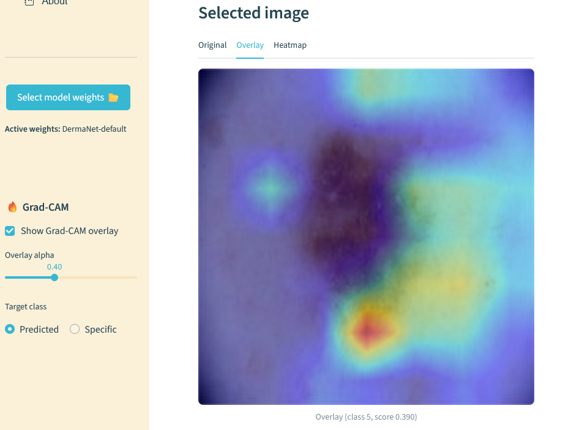

# DermaNet

This repo was made as the final project for the course "Advanced Computational Techniques for Big Imaging and Signal Data" — University of Milano‑Bicocca.

DermaNet (SkinMolesAI) implements a ResNet‑style skin lesion classifier with Squeeze‑and‑Excitation (SE) blocks and GeM pooling, supports BYOL self‑supervised pretraining of the backbone, and exposes a Streamlit dashboard for local inference and Grad‑CAM visualization.

The goal is to provide a practical pipeline for skin‑lesion classification (melanoma vs benign and other lesion classes) including:

- A ResNet‑style backbone enhanced with Squeeze‑and‑Excitation (SE) blocks and GeM pooling (`DermResNetSE` in `src/models/dermanet.py`).
- A PyTorch Lightning supervised training wrapper (`DermaNetLightning` in `src/models/dermanet_module.py`).
- BYOL self‑supervised pretraining to learn a backbone representation before supervised fine‑tuning (`src/models/byol.py` and `scripts/pretrain_byol.py`).
- A Streamlit dashboard for inference, image upload, clickable gallery cards, a traffic‑light risk indicator, and Grad‑CAM visualizations (`streamlit/app.py`, `streamlit/src/ui/home_page.py`, and `streamlit/src/services/gradcam.py`).


## Installation

System requirements
- Python 3.13 recommended (I used 3.13.5).
- GPU recommended for training and Grad‑CAM inference (PyTorch with CUDA). Install PyTorch / TorchVision using the official instructions for your CUDA: https://pytorch.org/get-started/locally/ (this repo does not pin a specific torch wheel in `requirements.txt`).

Create an environment and install dependencies

Example using conda:

```powershell
conda create -n dermanet python=3.13.5 -y
conda activate dermanet
pip install -r requirements.txt
# Install torch/torchvision according to your CUDA (example placeholder; follow pytorch.org):
pip install torch torchvision --index-url https://download.pytorch.org/whl/cu129
```

Notes
- `requirements.txt` contains packages such as `lightning`, `streamlit`, `albumentations`, and `opencv-python-headless`. The repository expects you to install `torch`/`torchvision` separately to match your system CUDA.
- `kaggle` library is used to download the ISIC 2019 and 2024 datasets. You can use the `data_analysis.ipynb` notebook to download and prepare the datasets.

### Datasets and expected layout
Supervised training uses a CSV metadata file and an image folder. Scripts expect flags `--csv` and `--img_dir` (see `scripts/train.py`). The ISIC 2019 csv file is provided in:

  - `data/isic2019/isic_2019_common.csv`
  
If You download the ISIC 2019 dataset using the data_analysis notebook, the images will be in:
  - `data/isic2019/ISIC_2019_Training_Input/ISIC_2019_Training_Input/`

which you should use as the `--img_dir` argument.


BYOL pretraining expects one-or-more image directories (which will be scanned recursivly for images) passed to `--data-dirs` (see `scripts/pretrain_byol.py`). Example:

  - `--data-dirs data/isic2019/ISIC_2019_Training_Input/ISIC_2019_Training_Input data/isic2024/train-image`

Place your downloaded datasets under the repository `data/` folder and pass the exact paths to the scripts (examples below).

## Streamlit Dashboard — running and using the app

You can launch the dashboard from the root of the repository with:

```bash
streamlit run streamlit/app.py
```

When the app starts, it will automatically load a set of default pretrained weights so that you can try it out immediately. If you prefer, you can select a different checkpoint from the sidebar.

Once the app is running, the **Home page** guides you through the workflow:

#### 1. Upload images
Drag and drop or select `.jpg`, `.jpeg`, or `.png` files. The images are stored locally under `streamlit/uploads/` and appear instantly in the gallery.

#### 2. Browse the gallery
Each uploaded image is shown as a card. Clicking on a card updates the main viewer with that image. On the top right of each card, you can see the **traffic-light indicator** (green / yellow / red) which gives a quick visual cue of the estimated risk. Risk is computed by `statistics.compute_malignancy_index()` as: $\text{risk score} = P(melanoma)\cdot 1.5 + P(basal cell carcinoma)\cdot 1.3 + P(squamous cell carcinoma)\cdot 1.0$.
Risk thresholds are set as: green < 0.15, yellow < 0.6, red >= 0.6.


#### 3. View predictions
For the selected image, the app first shows a simple two-bar comparison: **Benign vs Malignant**.  
- The malignant score is computed by `statistics.compute_malignancy_index()`.  
- The benign score is simply `1 – malignant`.  

You can expand the panel to see probabilities for all lesion classes.


#### 4. Interpret with Grad-CAM
If you want to see *why* the model made its decision, you can toggle **Grad-CAM overlay** in the sidebar and select the overlay display mode above the image. A heatmap will be blended with the image, highlighting the regions most influential for the prediction. You can adjust the overlay opacity with a slider.
You can either chose to display the Grad-CAM for the predicted class (default) or select a specific class (class number are in the same order as in the dropdown predictions panel).



---


## Training DermaNet (supervised)

To train the DermaNet model, use `scripts/train.py` (invoked via module form `python -m scripts.train`).
Example supervised training command (exact flags from `scripts/train.py`):

```powershell
python -m scripts.train \
  --csv data/isic2019/isic_2019_common.csv \
  --img_dir data/isic2019/ISIC_2019_Training_Input/ISIC_2019_Training_Input \
  --img_size 224 \
  --batch_size 256 \
  --epochs 100 \
  --experiment_name training_run \
  --num_workers 8 \
  --model_cfg cfgs/dermanet_default.yaml \
```

Files and logs will be saved under `outputs/dermanet/<experiment_name>/version_<N>/` (where `<N>` is the run number assigned by PyTorch Lightning logger).

Common flags and defaults (from `scripts/train.py`):
- `--csv` (required): metadata CSV path.
- `--img_dir` (required): root folder with images.
- `--img_size` (default: 224)
- `--batch_size` (default: 64)
- `--epochs` (default: 50)
- `--num_workers` (default: 8)
- `--devices` (default: 1) — number of GPUs to use.
- `--precision` (default: '32-true'; choices: '16-mixed', '32-true')
- `--model_cfg` YAML model config (e.g., `cfgs/dermanet_default.yaml`). If not provided, default parameters are used (please use the provided config to be sure).
- `--pretrain_ckpt` (optional): path to BYOL backbone `.pt` or `.ckpt` to initialize the backbone.
- `--gradient_clip_val` (default: 1.0): set to 0 to disable clipping.
- `--early_stop` (default: 8): patience for EarlyStopping on `val/acc1`.
- `--output_dir` (default: 'outputs/dermanet') — root folder for outputs and logs.
- `--experiment_name` (default: 'dermanet_training') — experiment name for logging.
- `--seed` (default: 42) — random seed for reproducibility.
- `--resume_version` (optional): if provided, resume from a previous run version (e.g., `0` to resume from `version_0`). Training will continue from the last checkpoint saved in that run seamlessly.
- `--pretrain_ckpt` (optional): path to BYOL pretrained backbone `.pt` or `.ckpt` to initialize the backbone.

**Class weights handling**
- `ISICDataModule` (in `src/data/isic_datamodule.py`) computes class weights on the training split. The `DermaNetLightning` module receives `class_weights` and registers them internally to apply weighted cross‑entropy.

**Checkpoints & logging**
- Checkpoints are created by `ModelCheckpoint` and saved under the run directory: `<output_dir>/<experiment_name>/version_<N>/ckpts/` (where `version_<N>` is assigned by PyTorch Lightning logger). The training script saves `best.ckpt` (based on `val/auroc`) and `last.ckpt`.
- The script uses TensorBoard logging, use `tensorboard --logdir outputs/dermanet/<experiment_name>` to inspect runs.


## BYOL Pretraining → DermaNet Fine‑tuning

To pretrain the backbone of DermaNet with BYOL use the script: `scripts/pretrain_byol.py`.

Example BYOL pretraining command (exact flags from `scripts/pretrain_byol.py`):

```powershell
python -m scripts.pretrain_byol \
  --data-dirs data/isic2019/ISIC_2019_Training_Input/ISIC_2019_Training_Input data/isic2024/train-image \
  --img-size 224 \
  --batch-size 512 \
  --max-epochs 100 \
  --num-workers 8 \
  --optimizer adamw \
  --experiment-name pretrain_run
  --model-cfg cfgs/dermanet_default.yaml \
```

In this case you shuld pass all the directories containing images (for example, both ISIC 2019 and ISIC 2024 training images) to `--data-dirs`. The script will scan them recursively for images. The other flags are:
- `--data-dirs` (required): one-or-more root folders with images.
- `--img-size` (default: 224)
- `--batch-size` (default: 256)
- `--max-epochs` (default: 100)
- `--num-workers` (default: 8)
- `--devices` (default: 1) — number of GPUs to use.
- `--precision` (default: '32-true'; choices: '16-mixed', '32-true')
- `--lr` (default: 3e-4)
- `--weight-decay` (default: 1e-4)
- `--base-momentum` (default: 0.996) — base momentum for the target network update.
- `--optimizer` (default: 'adamw'; for now only 'adamw' is supported).
- `--log-dir` (default: 'outputs/byol') — root folder for outputs and logs.
- `--experiment-name` (default: 'byol_pretrain') — experiment name for logging.
- `--gradient-clip-val` (default: 1.0): set to 0 to disable clipping.
- `--model-cfg` (optional): path to a YAML config file for the `DermResNetSE` model (see `cfgs/dermanet_default.yaml` for an example). If not provided, the script will use default parameters (please use the provided config to be sure).
- `--seed` (default: 42) — random seed for reproducibility.
- `--accumulate-grad-batches` (default: 1) — accumulate gradients over N batches to simulate a larger effective batch size.

**Grad/Weight monitor callback**
- The BYOL pretraining script registers a `GradWeightMonitor` callback (see `src/utils/gradweightmonitor.py`) which can log gradient norms, histograms, and dump state on non‑finite gradients. In `scripts/pretrain_byol.py` it is configured with `log_hist_every_n_steps=200` and `stop_on_nonfinite=True` by default; adjust in the script if you want to disable histograms or dumping.

#### Loading BYOL weights into DermaNet for fine‑tuning
- The supervised training script (`scripts/train.py`) supports `--pretrain_ckpt` to pass the BYOL backbone file. Internally it contains a `load_byol_backbone(pretrain_path, target_model)` helper that attempts to match and copy any compatible keys from the BYOL checkpoint into the `DermResNetSE` instance used by `DermaNetLightning`.

Example (i did not upload the actual BYOL weights here, just a placeholder path):

```powershell
python -m scripts.train \
  --csv data/isic2019/isic_2019_common.csv \
  --img_dir data/isic2019/ISIC_2019_Training_Input/ISIC_2019_Training_Input \
  --pretrain_ckpt outputs/byol/pretraining/ckpts/byol-epoch=020.ckpt \
  --experiment_name finetune_with_byol
  --img_size 224 \
  --batch_size 256 \
  --epochs 100 \
  --early_stop 10 \
```

**Warnings & notes**
- GeM pooling parameter `p` is implemented as a positive trainable scalar in `src/models/modules.py` and the BYOL optimizer excludes it from weight decay. The code uses float32 computations (even if mixed precision is used) to reduce NaN risk; I did however notice occasional NaNs during BYOL pretraining, keep an eye out for that.